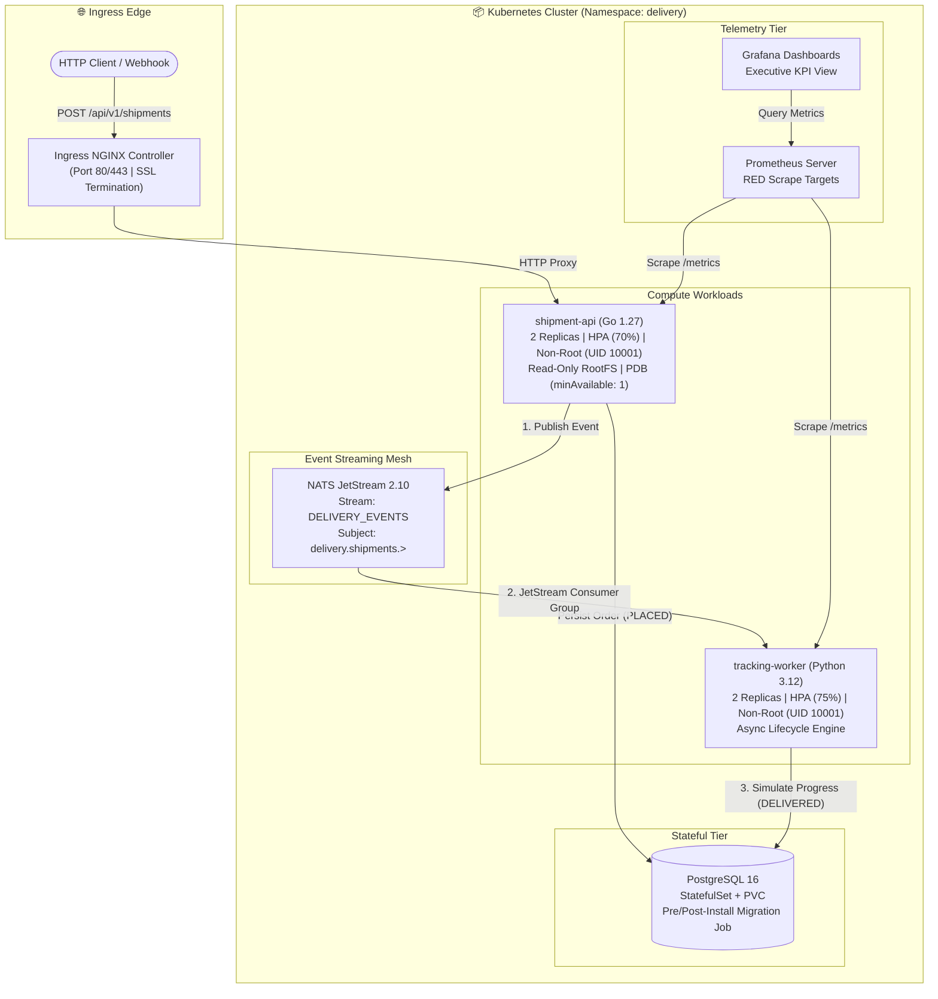

# 🚀 Kube Delivery Platform

[](https://github.com/AAAmer91/kube-delivery-platform/actions/workflows/pr-validation.yml)
[](https://github.com/AAAmer91/kube-delivery-platform/actions/workflows/e2e-kind.yml)
[](https://github.com/AAAmer91/kube-delivery-platform/actions/workflows/security-scans.yml)
[](LICENSE)

An enterprise-grade, cloud-native delivery platform engineered to demonstrate advanced **Docker container hardening**, **Kubernetes platform engineering**, **Argo CD GitOps**, and **Argo Rollouts progressive canary delivery**.

---

## 🏗️ Platform Architecture



---

## 🌟 Key Engineering Capabilities

| Engineering Domain | Highlights & Capabilities |
| :--- | :--- |
| **🐳 Docker Engineering** | Multi-stage builds, minimal non-root base images (`UID 10001`), BuildKit cache mounts, read-only root filesystems, explicit health checks, Hadolint linting, blocking Trivy CVE scans, CycloneDX SBOMs, signed provenance/SBOM attestations, and multi-arch images (`linux/amd64`, `linux/arm64`). |
| **☸️ Kubernetes Platform** | Umbrella Helm chart (`values-preview.yaml`, `values-staging.yaml`, `values-prod.yaml`), zero-trust `NetworkPolicy` (default-deny), `HorizontalPodAutoscaler` (HPA), `PodDisruptionBudget` (PDB), `TopologySpreadConstraints`, Pod Anti-Affinity, least-privilege RBAC. |
| **🛡️ Kyverno Governance** | Policy-as-code cluster admission: disallows root users, mandates CPU/memory limits, enforces read-only rootfs, drops ALL capabilities, restricts image registries. |
| **🚀 GitOps & Progressive Delivery** | Argo CD App-of-Apps pattern (`root-app.yaml`, `app-staging.yaml`, `app-prod.yaml`), Argo Rollouts canary traffic steps (`10% -> 25% -> 50% -> 100%`) with automated metric rollback gates (`AnalysisTemplate`). |
| **📊 Observability & RED Metrics** | Prometheus metric scraping, alert rules for error spikes and consumer lag, OpenTelemetry collector, Grafana dashboard as code visualizing RED metrics (Rate, Errors, Duration). |
| **🧪 Automated Chaos Drills** | Automated pod deletion self-healing verification, unauthorized NetworkPolicy breach tests, HPA scaling under load, and deliberate bad-canary rollback drills. |

---

## 📂 Repository Structure

```text
├── services/
│   ├── shipment-api/                  # Go 1.27 REST API Service
│   └── tracking-worker/               # Python 3.12 Event Processor Service
├── deploy/
│   ├── compose/                       # Local Dev Docker Compose & DB Schema
│   ├── helm/kube-delivery-platform/   # Production-Grade Umbrella Helm Chart
│   ├── argocd/                        # Argo CD App-of-Apps & Environment Applications
│   ├── argo-rollouts/                 # Progressive Delivery Rollouts & AnalysisTemplates
│   ├── policies/                      # Kyverno Governance ClusterPolicies
│   └── kind/                          # Multi-Node Kind Cluster Topology
├── observability/
│   ├── prometheus/                    # Alert rules and scrape configs
│   ├── grafana/                       # Dashboards as code (RED Metrics & Pod Health)
│   └── otel/                          # OpenTelemetry collector config
├── tests/
│   ├── contract/                      # OpenAPI & CloudEvent schema tests
│   ├── integration/                   # Idempotency and database tests
│   ├── e2e/                           # End-to-end shipment lifecycle tests
│   └── resilience/                    # Chaos drills (pod recovery, network isolation)
├── scripts/                           # Traffic generation, schema validation, summary tools
├── docs/                              # In-depth architectural documentation
├── Makefile
└── README.md
```

---

## 🚦 Quickstart & Local Verification

### 1. Run Unit & Contract Tests
```bash
make test
```

### 2. Validate Kubernetes & Policy Manifests
```bash
make verify-manifests
```

For Kubernetes deployment, provision a `kube-delivery-database` Secret containing
`POSTGRES_PASSWORD` and `DATABASE_URL`. CI generates an ephemeral Secret; staging
and production are designed for an external secret manager.

### 3. Start Local Docker Compose Stack
```bash
make compose-up
```

---

## 📚 In-Depth Technical Documentation

* [📖 Docker Architecture & Hardening Guide](docs/DOCKER.md)
* [☸️ Kubernetes Platform Architecture](docs/KUBERNETES.md)
* [🚀 GitOps & Progressive Delivery with Argo](docs/GITOPS.md)
* [🛡️ Platform Security & Threat Model](docs/SECURITY.md)
* [📖 Platform Operations & Incident Runbook](docs/RUNBOOK.md)

---

## 📄 License
This project is licensed under the [MIT License](LICENSE).
