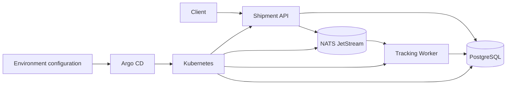

# Kube Delivery Platform

[](https://github.com/AAAmer91/kube-delivery-platform/actions/workflows/ci.yml)
[](https://github.com/AAAmer91/kube-delivery-platform/actions/workflows/security.yml)
[](https://securityscorecards.dev/viewer/?uri=github.com/AAAmer91/kube-delivery-platform)

Kube Delivery Platform is a proof of concept for an internal Kubernetes delivery platform. It models how a small application can move from source code to a controlled runtime using container images, Helm, policy checks, GitOps promotion, and progressive delivery.

The repository is intentionally self-contained so that the delivery model can be evaluated without depending on an existing company platform. It is not a hosted product. A production adoption would still need organization-specific identity, secret management, managed data services, capacity planning, backup and disaster-recovery policies.

## Start here

If Docker, Kubernetes, or GitOps is new to you, read the [beginner guide](docs/BEGINNER_GUIDE.md) first.

At a high level:

1. A client submits a shipment to the API.
2. The API stores the shipment in PostgreSQL and publishes an event to NATS.
3. A worker consumes the event and updates the shipment status.
4. Docker packages both services, while Helm describes how they run on Kubernetes.
5. Argo CD reconciles the declared environment configuration with a cluster.

## Architecture



## Engineering scope

| Area | Current implementation |
| --- | --- |
| Containers | Multi-stage, non-root images built with Docker Buildx |
| Kubernetes | Helm chart with probes, resource controls, autoscaling, disruption budgets, and network policies |
| Policy | Kyverno rules for image, privilege, and resource requirements |
| GitOps | Argo CD applications for staging and production configuration |
| Progressive delivery | Argo Rollouts canary steps with metric-based analysis templates |
| Observability | Prometheus metrics and Grafana dashboard definitions |
| Verification | Unit, contract, integration, resilience, manifest, and security checks |
| Supply chain | Vulnerability scanning, SBOM generation, image signing, and provenance attestations |

## Repository layout

```text
services/                    Application source and tests
deploy/helm/                 Kubernetes package and environment values
deploy/argocd/               Argo CD application definitions
deploy/policies/             Kyverno admission policies
deploy/argo-rollouts/        Shared rollout analysis resources
observability/               Prometheus, Grafana, and OpenTelemetry configuration
scripts/                     Validation and operational helpers
docs/                        Design and operating documentation
.github/workflows/           Continuous integration and delivery workflows
```

## Local development

Prerequisites:

- Docker with Compose v2
- GNU Make
- Go 1.27 or later for running `shipment-api` and its tests outside containers

Start the application dependencies and services:

```bash
make compose-up
```

Run the test suites and static checks:

```bash
make test
make lint
make verify-manifests
```

Stop the local environment:

```bash
make compose-down
```

The Helm chart expects `POSTGRES_PASSWORD` and `DATABASE_URL` to be supplied through a Kubernetes Secret. See [Kubernetes deployment](docs/KUBERNETES.md) before installing it in a cluster.

## Documentation

- [Beginner guide](docs/BEGINNER_GUIDE.md) — concepts, request flow, and a suggested reading path
- [Docker design](docs/DOCKER.md) — image construction and runtime controls
- [Kubernetes deployment](docs/KUBERNETES.md) — chart structure, workloads, and policies
- [GitOps and rollout model](docs/GITOPS.md) — reconciliation, promotion, and canary analysis
- [Security model](docs/SECURITY.md) — trust boundaries and layered controls
- [Operations runbook](docs/RUNBOOK.md) — incident checks and recovery actions
- [GitHub setup](docs/GITHUB_SETUP.md) — repository settings required by the workflows

## License

This project is licensed under the MIT License. See [LICENSE](LICENSE).
