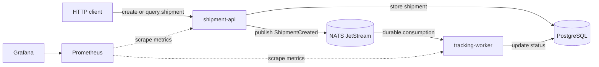

# Beginner Guide

This guide explains the complete project from application request to Kubernetes deployment. It assumes no previous Docker, Kubernetes, Helm, or GitOps experience. Where the repository models a production practice but does not provide the surrounding company infrastructure, the boundary is called out explicitly.

## 1. What problem does this project solve?

A shipment system has two different kinds of work:

- a customer-facing request that should validate and respond quickly;
- background tracking work that can continue after the request has completed.

Putting both responsibilities in one process would make the HTTP request wait for every tracking step. It would also make the API and worker scale together even though they have different workloads. This proof of concept separates them into two services and adds the platform controls needed to package, deploy, observe, and update them safely.

The result is a working slice of an internal delivery platform, not a hosted logistics product. The shipment domain keeps the application understandable while the repository concentrates on containers and Kubernetes operations.

## 2. The system in one picture



The main components are:

| Component | Responsibility | Implementation |
| --- | --- | --- |
| `shipment-api` | Validate HTTP requests, store shipments, publish creation events, and answer queries | Go service |
| `tracking-worker` | Consume shipment events and advance shipment status in the background | Python service |
| PostgreSQL | Store shipment records and their current state | Database container or StatefulSet |
| NATS JetStream | Persist and deliver shipment events | Message broker container or StatefulSet |
| Helm | Render the Kubernetes resources for an environment | Umbrella chart under `deploy/helm/` |
| Argo CD | Reconcile approved Git configuration into a cluster | App-of-apps definitions under `deploy/argocd/` |
| Argo Rollouts | Control staged shipment API releases | Canary rollout and analysis resources |
| Kyverno | Reject workloads that violate platform policy | Policies under `deploy/policies/` |
| Prometheus and Grafana | Collect metrics, evaluate alerts, and visualize behavior | Configuration under `observability/` |

## 3. Follow one shipment through the application

### Step 1: a client creates a shipment

The client sends `POST /api/v1/shipments` to `shipment-api`. A representative body is:

```json
{
  "sender_name": "North Warehouse",
  "recipient_name": "Customer A",
  "origin": "Cairo",
  "destination": "Alexandria",
  "weight_kg": 4.5
}
```

The API rejects missing names or locations and non-positive weight. For a valid request it generates a shipment ID and tracking number, assigns the initial `PLACED` status, and writes the record to PostgreSQL.

### Step 2: the API publishes an event

After storing the record, the API publishes a `ShipmentCreated` event to the `delivery.shipments.created` NATS subject in the `DELIVERY_EVENTS` stream. The event contains identifiers, the initial status, a timestamp, and a correlation ID.

The database record is the current shipment state. The event communicates that the state change occurred. This distinction matters: an event is not a second database row or an HTTP response; it is a message for interested background consumers.

### Step 3: the worker consumes the event

`tracking-worker` uses the durable consumer group `tracking-workers`. JetStream retains delivery state, so a worker restart does not require every event to be republished.

For this proof of concept, the worker advances a shipment through:

```text
PLACED -> PROCESSING -> IN_TRANSIT -> DELIVERED
```

Each database update is conditional on the expected preceding state. Reprocessing an already-applied transition therefore does not corrupt the current status. This is an example of idempotent behavior: repeating work has the same intended result as processing it once.

Malformed or incomplete events are acknowledged after being logged as poison events so they do not block the consumer forever. A production design would normally add an explicit quarantine stream or dead-letter workflow with ownership and replay rules.

### Step 4: the client reads the result

The API supports:

| Endpoint | Purpose |
| --- | --- |
| `POST /api/v1/shipments` | Create a shipment |
| `GET /api/v1/shipments` | List shipments with pagination |
| `GET /api/v1/shipments/{id}` | Read one shipment by ID |
| `GET /healthz` | Confirm that the process is alive |
| `GET /ready` | Confirm that required dependencies are usable |
| `GET /metrics` | Expose Prometheus metrics |
| `GET /version` | Report the application build revision |

The create response confirms that a shipment was accepted and the event was published. Background progression may still be underway when the response returns.

## 4. Why use asynchronous processing?

The API and worker are separated by NATS instead of calling each other directly. This provides several useful properties:

- the API can finish without waiting for all status changes;
- temporary worker downtime does not immediately make the API unavailable;
- worker replicas can scale independently from API replicas;
- the event stream gives the worker a durable source of work.

The tradeoff is eventual consistency. A client may read `PLACED` shortly before the worker changes it to `PROCESSING`. Operators must also monitor backlog, failed messages, and consumer health. Asynchronous systems move some complexity out of the request path; they do not remove it.

## 5. How Docker packages the services

A Docker image is an immutable filesystem and metadata package. A container is a running process created from that image.

Both service Dockerfiles use multiple stages:

- the Go image compiles the API in a builder stage and copies only the resulting binary and runtime files into the final image;
- the Python image installs dependencies in a builder stage and copies them into a smaller runtime image.

The runtime images use UID/GID `10001`, a read-only root filesystem in deployment, dropped Linux capabilities, and a runtime-default seccomp profile. These controls limit what a compromised process can change, but they do not replace application authorization, dependency maintenance, or cluster security.

Docker Compose starts the complete application on one machine:

```text
PostgreSQL + NATS + shipment-api + tracking-worker
```

Compose is the simplest path for application development. It supplies dependency health checks, persistent local volumes, a private bridge network, resource limits, and the environment variables expected by both services. It does not simulate Kubernetes scheduling, admission policy, multi-node disruption, or GitOps reconciliation.

See [Docker design](DOCKER.md) for the image stages, runtime controls, and supply-chain outputs.

## 6. How Kubernetes runs the platform

Kubernetes accepts a desired state and continuously tries to make the cluster match it. The main objects in this project are:

| Kubernetes object | Plain-language role in this project |
| --- | --- |
| Pod | The smallest scheduled unit containing a service container |
| Deployment | Maintains ordinary API or worker replicas in preview environments |
| StatefulSet | Gives PostgreSQL and NATS stable identity and persistent storage |
| Service | Provides a stable internal network name in front of changing pods |
| Ingress | Routes external HTTP traffic to `shipment-api` |
| ConfigMap | Supplies non-secret runtime configuration |
| Secret | Supplies database credentials and connection details |
| Job | Applies the database schema during installation or upgrade |
| HPA | Adjusts API and worker replicas from CPU and memory utilization |
| PDB | Preserves at least one application replica during voluntary disruption |
| NetworkPolicy | Limits which workloads may communicate |
| ServiceMonitor | Tells Prometheus where application metrics are exposed |
| Rollout | Replaces the API Deployment in staging and production to support canaries |

### Probes are different signals

- A startup probe gives a slow-starting process time to initialize.
- A readiness probe decides whether a pod should receive traffic.
- A liveness probe decides whether Kubernetes should restart the container.

Treating every probe as the same health check can cause restart loops or send traffic to a process whose dependencies are unavailable. The API and worker expose separate liveness and readiness behavior for that reason.

### Resources and availability controls

Resource requests tell the scheduler what capacity a pod needs. Limits bound its maximum CPU or memory use. HPAs target 70% CPU and 80% memory, while topology spread and preferred anti-affinity distribute replicas when the cluster has suitable nodes. These controls manage existing capacity; they cannot create new nodes or guarantee availability if the cluster is undersized.

### Network and admission controls

The namespace starts with default-deny networking. Narrow policies then allow only expected paths, such as API-to-PostgreSQL, API-to-NATS, worker-to-PostgreSQL, worker-to-NATS, DNS, ingress, and monitoring.

Kyverno validates workloads in namespaces labeled with `platform.kube-delivery.io/security-profile=restricted`. It requires non-root execution, resource requests and limits, read-only root filesystems, dropped capabilities, and approved image registries. NetworkPolicy needs a compatible network plugin, and Kyverno must already be installed for these declarations to be enforced.

See [Kubernetes deployment](KUBERNETES.md) for installation details and policy caveats.

## 7. Helm and environment configuration

Helm combines templates with values to produce Kubernetes YAML. This repository uses one umbrella chart rather than duplicating manifests per environment.

| Values file | Intended use |
| --- | --- |
| `values.yaml` | Shared defaults |
| `values-preview.yaml` | Short-lived validation in CI or a development namespace |
| `values-staging.yaml` | Staging configuration and immutable image digests |
| `values-prod.yaml` | Production-style configuration and immutable image digests |

The chart schema validates important value types before rendering. Environment files change settings such as image coordinates, replicas, resource sizing, ingress, and rollout behavior while the templates remain shared.

Secrets are deliberately not committed to the values files. The chart expects a Kubernetes Secret containing `POSTGRES_PASSWORD` and `DATABASE_URL`. A production cluster would normally obtain those values from an approved secret-management system rather than a manually created Secret.

## 8. From a source change to staging

The delivery path separates building an artifact from approving where it runs:

```mermaid
flowchart LR
    Push[Service change on main] --> Build[Build both images]
    Build --> Scan[Trivy scan and SBOM]
    Scan --> Attest[Sign and attest digests]
    Attest --> Collect[Collect exact same-run digest pair]
    Collect --> Verify[Verify provenance]
    Verify --> PR[Open staging values PR]
    PR --> Gates[Application, Helm, Kind, and CodeQL checks]
    Gates --> Merge[Reviewed merge]
    Merge --> Argo[Argo CD reconciliation]
```



Important details:

1. Docker Buildx publishes `linux/amd64` and `linux/arm64` images to GHCR.
2. Trivy scans each image, a CycloneDX SBOM is generated, and GitHub provenance is attached.
3. Each matrix job uploads its full `sha256:...` OCI manifest digest.
4. A fail-closed collector accepts exactly the two digest files from that workflow run. It rejects missing, unexpected, or malformed values.
5. The reusable GitOps workflow verifies that both images were attested by this repository's build workflow.
6. It changes only the target environment values file and opens a promotion pull request.
7. Required validation workflows run against the promotion commit before it can be merged.

An OCI digest identifies image content. A Git commit SHA identifies source history. They are related through provenance, but they are not interchangeable.

Only staging is promoted automatically from a qualifying `main` push. Production promotion remains a manual workflow action and can require protected-environment approval. GitOps-only changes are excluded from the image-build path, preventing a merged promotion PR from starting an endless build loop.

See [GitOps and progressive delivery](GITOPS.md) and [GitHub repository setup](GITHUB_SETUP.md) for the detailed controls.

## 9. What Argo CD and canary delivery do

Argo CD compares Git with the live cluster. Staging enables automatic synchronization and pruning. Production reconciliation is manual, allowing repository and environment approval rules to control the change.

The root Argo CD application creates an app-of-apps hierarchy. Sync waves install dependencies in order: controllers first, then observability and governance, then application environments.

For staging and production, `shipment-api` is rendered as an Argo Rollout. A candidate version receives traffic in stages:

```text
10% -> 25% -> 50% -> 100%
```

Prometheus analysis checks HTTP 5xx ratio and p99 latency at each stage. Repeated failures abort the rollout and return traffic to the stable ReplicaSet. This mechanism depends on healthy ingress, useful metrics, enough traffic, and correctly chosen thresholds; declaring a canary does not guarantee a safe release by itself.

## 10. Observability and operations

The services expose Prometheus counters, gauges, and latency metrics. Prometheus configuration and alert rules live under `observability/prometheus/`; Grafana provisioning and the dashboard definition live under `observability/grafana/`. The OpenTelemetry Collector configuration provides a place to extend telemetry processing.

Useful signals include:

- API request rate, error ratio, and latency;
- successful and failed event publication;
- worker processing and poison-event counts;
- dependency readiness;
- NATS backlog and consumer health;
- pod restarts, unavailable replicas, and rollout state.

The repository runbook covers high API error rate and worker backlog or poison events. Its main operating principle is to diagnose from logs, workload state, dependency health, and recent changes before restarting or scaling components. Any emergency cluster change should later be reflected in Git or reverted so desired and actual state do not drift silently.

## 11. How the repository verifies changes

The tests and workflows cover different layers:

| Layer | What it checks |
| --- | --- |
| Go and Python unit tests | Service behavior in isolation |
| Contract tests | API schemas, workflow handoffs, Helm-rendered invariants, and evidence summaries |
| Integration tests | Idempotent status transitions and component interaction |
| Kind end-to-end test | Real containers and Helm resources in an ephemeral Kubernetes cluster |
| Resilience drills | Pod self-healing, NetworkPolicy isolation, and Kyverno rejection behavior |
| Hadolint, Ruff, and Mypy | Dockerfile and Python quality |
| CodeQL and dependency automation | Source and dependency risk detection |
| Trivy, SBOM, signatures, and attestations | Published-image supply-chain evidence |
| OpenSSF Scorecard | Repository security-practice signals |

A passing test proves only its stated boundary. For example, a Kind test validates this chart on an ephemeral cluster; it does not establish production capacity, storage durability, or disaster recovery.

## 12. Repository map

```text
services/
  shipment-api/                 Go HTTP API and NATS publisher
  tracking-worker/              Python JetStream consumer
deploy/
  compose/                      Single-machine development stack
  helm/kube-delivery-platform/  Shared chart and environment values
  argocd/                       App-of-apps GitOps definitions
  policies/                     Kyverno admission policies
  argo-rollouts/                Shared rollout analysis resources
  kind/                         Ephemeral CI cluster configuration
observability/                  Prometheus, Grafana, and OTel configuration
scripts/                        Validation, evidence, and traffic helpers
tests/                          Contract, integration, end-to-end, and resilience tests
.github/workflows/              Build, validation, security, and promotion automation
docs/                           Design and operating documentation
```

## 13. A practical learning path

### First pass: understand the application

1. Read `services/shipment-api/internal/domain/shipment.go` for the data model.
2. Read `services/shipment-api/internal/handlers/handlers.go` for the HTTP flow.
3. Read `services/tracking-worker/src/consumer.py` for event processing.
4. Compare those components with `deploy/compose/docker-compose.yml`.

### Second pass: understand the Kubernetes package

1. Start with `deploy/helm/kube-delivery-platform/values.yaml`.
2. Compare preview, staging, and production values.
3. Read one service template, one StatefulSet, and the network policies.
4. Read the Kyverno policies and identify which chart settings satisfy them.

### Third pass: understand delivery and operations

1. Read `.github/workflows/pr-validation.yml`.
2. Follow `.github/workflows/build-and-publish.yml` into `gitops-deploy.yml`.
3. Compare the Argo CD staging and production applications.
4. Read [Security model](SECURITY.md) and [Operations runbook](RUNBOOK.md).

## 14. Common misunderstandings

- **“A container is a virtual machine.”** A container is an isolated process sharing the host kernel; it is generally smaller and less isolated than a VM.
- **“A successful image build means the deployment is healthy.”** Build, admission, rollout, runtime health, and business behavior are separate gates.
- **“A tag is immutable.”** Tags can move. The environment values use manifest digests because a digest identifies exact content.
- **“GitOps means nobody can use `kubectl`.”** Emergency access can still exist, but changes outside Git must be controlled and reconciled afterward.
- **“Two replicas guarantee availability.”** Availability also depends on nodes, zones, storage, networking, dependencies, and disruption policy.
- **“A canary automatically detects every bad release.”** It can react only to the metrics and thresholds it evaluates.
- **“NetworkPolicy blocks everything by default.”** Enforcement depends on the cluster network plugin and correctly selected pods and namespaces.

## 15. Proof-of-concept boundaries

The repository does not provision a managed cluster, DNS, TLS certificates, a shared Argo CD control plane, an external secret manager, production-grade PostgreSQL or NATS operations, backups, cross-region recovery, centralized identity, alert delivery, or capacity management.

Those omissions are deliberate boundaries, not claims that the concerns are unnecessary. Before production adoption, an owning team would define service-level objectives, data recovery objectives, security ownership, cost controls, scaling assumptions, upgrade policy, incident response, and the managed platform services used in the target environment.
