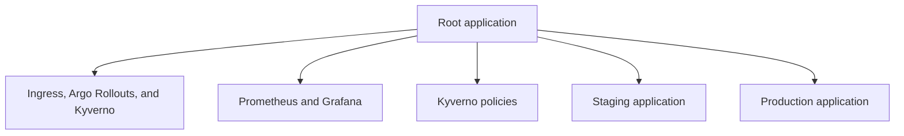

# GitOps and Progressive Delivery

This proof of concept uses Git as the reviewed record of desired cluster state. Argo CD compares that state with the cluster and applies the configured reconciliation policy. Operational access still needs a documented break-glass procedure for incidents in a production implementation.

## Reconciliation model



Argo CD is the bootstrap prerequisite. Applying `deploy/argocd/root-app.yaml` creates the app-of-apps hierarchy. Sync waves place controllers before the resources that depend on them:

- platform controllers use sync wave `-4`;
- observability uses `-2`;
- governance uses `-1`;
- application environments follow those dependencies.

The staging application enables automated sync and pruning. Production sync is manual so that repository environment protection and an operator approval can control promotion.

## Canary rollout

For staging and production, Helm renders `shipment-api` as an Argo Rollout. NGINX canary ingress resources route traffic between stable and candidate ReplicaSets.

The configured sequence is:

1. route 10% of traffic to the candidate, pause, and analyze;
2. route 25%, pause, and analyze;
3. route 50%, pause, and analyze;
4. route 100% and complete the promotion.

At each analysis step, Prometheus queries check that:

- the HTTP 5xx ratio is at most 1%;
- p99 request latency is at most 500 ms.

Three failed measurements cause the rollout to abort. Argo Rollouts then returns traffic to the stable ReplicaSet. Availability still depends on ingress health, capacity, application compatibility, and the metrics pipeline, so the mechanism should be tested under the conditions of the target cluster.

## Image promotion

Application images are referenced by immutable digest in environment values. The promotion workflow updates those values through a pull request, which keeps the proposed artifact change reviewable and auditable.

### Automatic staging path

A push to `main` that changes a service or the image-build workflow follows one continuous delivery chain:

1. `build-and-publish.yml` builds both services from the same source commit.
2. Each matrix job scans, publishes, signs, and attests its image, then uploads the resulting OCI digest as a small workflow artifact.
3. A collector job downloads exactly those two artifacts from the current run and rejects missing, extra, or malformed values.
4. The reusable `gitops-deploy.yml` workflow verifies both build-provenance attestations and proposes the digest pair in `values-staging.yaml`.
5. The workflow opens a promotion pull request and explicitly runs the repository's required application, Kubernetes, and CodeQL checks against its head commit.
6. After review and merge, Argo CD can reconcile the approved staging state.

The digest handoff never searches for a merely "latest" successful run, so images from different commits cannot be paired accidentally. GitOps-only commits do not match the build workflow's path filter; merging the generated promotion PR therefore cannot start a promotion loop.

### Manual and production path

`gitops-deploy.yml` remains manually runnable from **Actions → GitOps Progressive Delivery & Promotion → Run workflow**. Choose `staging` or `production` and supply the two full OCI manifest digests in `sha256:<64 lowercase hexadecimal characters>` form. The build run summary displays these values and labels the corresponding input names.

Manual staging promotion is useful for recovery or for intentionally redeploying a previously verified artifact. Production remains explicit: it is never invoked by the automatic staging chain and can be held behind GitHub environment reviewers. Both paths verify that the requested images were attested by this repository's build workflow before changing desired state.

Promotion branches include both the GitHub run ID and run-attempt number. A rerun therefore opens a new branch instead of rewriting the branch created by an earlier attempt. After changing the workflow definition itself, start a new manual run because GitHub reruns use the workflow from the original run's commit.

## Operator commands

Set the namespace and release-specific rollout name before using these commands:

```bash
kubectl argo rollouts get rollout kube-delivery-shipment-api -n delivery
kubectl argo rollouts promote kube-delivery-shipment-api -n delivery
kubectl argo rollouts abort kube-delivery-shipment-api -n delivery
kubectl argo rollouts undo kube-delivery-shipment-api -n delivery
```

Use `promote` only after reviewing the current analysis results. `abort` stops the active update; `undo` changes the desired revision and should be reconciled with Git afterward.

## Limitations

The repository defines the applications and rollout policy but does not provision a shared Argo CD control plane, DNS, certificates, or a managed Prometheus service. Those are platform-level concerns for the target environment.
