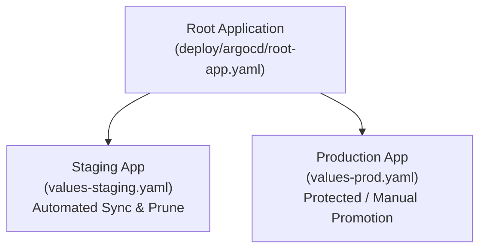

# 🚀 GitOps & Progressive Delivery with Argo CD & Argo Rollouts

The platform follows **declarative GitOps principles**: Git is the single source of truth for all cluster desired state. Direct ad-hoc production mutations are prohibited.

---

## 🏗️ GitOps Architecture: App-of-Apps Pattern



---

## 🎯 Argo Rollouts Canary Strategy for `shipment-api`

In staging and production, `shipment-api` is managed by an **Argo Rollout** rather than a standard Deployment.

### Canary Traffic Progression
1. **Step 1:** Route `10%` traffic to Canary $\to$ Pause 30s + Run Prometheus Analysis.
2. **Step 2:** Route `25%` traffic to Canary $\to$ Pause 30s + Run Prometheus Analysis.
3. **Step 3:** Route `50%` traffic to Canary $\to$ Pause 30s + Run Prometheus Analysis.
4. **Step 4:** Route `100%` traffic to Canary $\to$ Promote to Stable.

### Automated Metric Analysis Gate (`AnalysisTemplate`)
The rollout continuously queries Prometheus during each step:
* **HTTP 5xx Error Rate:** Must remain $\le 1\%$.
* **p99 Latency:** Must remain $\le 500\text{ms}$.

If an unhandled exception or latency spike occurs during the canary window, **Argo Rollouts automatically aborts the rollout and restores 100% traffic to the stable replica set with zero user downtime**.

---

## 🛠️ CLI Rollout Commands

```bash
# View live rollout progression
kubectl argo rollouts get rollout kube-delivery-shipment-api -n delivery

# Manually promote canary step
kubectl argo rollouts promote kube-delivery-shipment-api -n delivery

# Abort and rollback immediately
kubectl argo rollouts abort kube-delivery-shipment-api -n delivery
kubectl argo rollouts undo kube-delivery-shipment-api -n delivery
```
