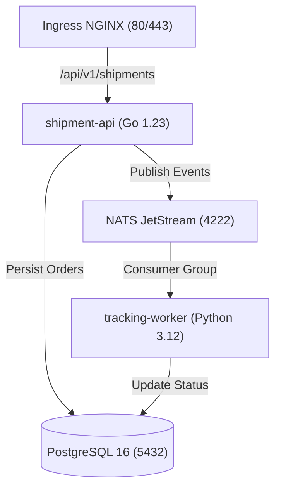

# ☸️ Kubernetes Platform Architecture & Helm Guide

The **Kube Delivery Platform** is deployed using a single umbrella Helm chart (`deploy/helm/kube-delivery-platform/`) with dedicated environment overlays (`preview`, `staging`, `production`).

---

## 🏗️ Architecture Components

---

## 🛡️ Key Platform Capabilities Demonstrated

### 1. Zero-Trust Network Policies
Default-deny ingress and egress applied across the namespace:
* **`default-deny-all`:** Closes all inter-pod communications by default.
* **`allow-shipment-api`:** Permits ingress from Ingress Controller / Prometheus, egress only to PostgreSQL (5432), NATS (4222), and CoreDNS (53).
* **`allow-tracking-worker`:** Permits egress to PostgreSQL (5432), NATS (4222), and CoreDNS (53).
* **`allow-postgres`:** Restricts 5432 ingress strictly to API, Worker, and Migration Job pods.

### 2. High Availability & Resilience
* **HorizontalPodAutoscaler (HPA):** Auto-scales pods horizontally based on CPU (70%) and Memory (80%) targets.
* **PodDisruptionBudget (PDB):** Guarantees `minAvailable: 1` during node drains and Kubernetes upgrades.
* **Topology Spread Constraints:** Distributes replicas evenly across cloud availability zones (`topology.kubernetes.io/zone`).
* **Pod Anti-Affinity:** Soft anti-affinity prevents colocation of identical pods on the same node.

### 3. Least-Privilege RBAC & Security Contexts
* Dedicated unprivileged `ServiceAccount` with `automountServiceAccountToken: false`.
* `runAsNonRoot: true`, `readOnlyRootFilesystem: true`, `capabilities: { drop: ["ALL"] }`.

### 4. Database Lifecycle & Helm Hooks
* Database schema initialization is executed via a pre/post-install Helm Job (`migration-job.yaml`) ensuring zero-downtime schema evolution.

### 5. Kyverno Cluster Governance
Enforces policy-as-code before workloads are admitted:
* Rejects pods running as root.
* Requires memory/CPU resource requests and limits.
* Mandates read-only root filesystems.
* Enforces dropped Linux capabilities.
