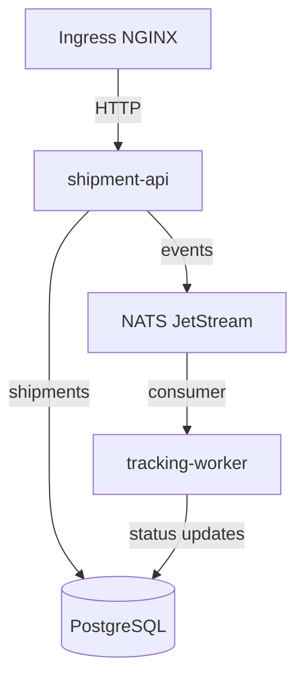

# Kubernetes Deployment

The application is packaged as one umbrella Helm chart at `deploy/helm/kube-delivery-platform/`. Environment values select the image references, replica counts, resource settings, and rollout behavior for preview, staging, and production-style deployments.

## Workload flow



The API and worker are stateless application workloads. PostgreSQL and NATS use StatefulSets because they require stable identity and storage. In a production environment, these dependencies may instead be managed services with separate operational ownership.

## Runtime controls

### Health and resources

The chart defines startup, readiness, and liveness probes so Kubernetes can distinguish initialization, traffic readiness, and an unhealthy process. Resource requests and limits give the scheduler capacity information and bound container usage.

HorizontalPodAutoscalers target 70% CPU and 80% memory utilization. PodDisruptionBudgets retain at least one application replica during voluntary disruptions. Topology spread constraints and preferred anti-affinity distribute replicas when the cluster has enough nodes and zones; they do not create capacity on their own.

### Identity and process restrictions

Application service accounts disable automatic API token mounting. Pod and container security contexts require a non-root user, a read-only root filesystem, dropped capabilities, and the runtime-default seccomp profile.

### Network policy

The namespace begins with default-deny ingress and egress. Additional policies allow only the expected paths:

- ingress and Prometheus reach `shipment-api`;
- the API reaches PostgreSQL, NATS, and DNS;
- the worker reaches PostgreSQL, NATS, and DNS;
- API, worker, and migration pods reach PostgreSQL;
- the required monitoring paths are opened explicitly.

Effective enforcement requires a network-policy-capable cluster network plugin.

## Database migration

`templates/postgres/migration-job.yaml` is an idempotent `post-install,post-upgrade` Helm hook. It waits for PostgreSQL and applies the schema after the release resources are created. Schema changes still need backward-compatible application releases when old and new pods can overlap during a rollout.

## Admission policy

Kyverno policies under `deploy/policies/` validate workloads in namespaces labeled `platform.kube-delivery.io/security-profile=restricted`. They require non-root execution, resource settings, a read-only root filesystem, dropped capabilities, and an approved image registry.

Kyverno must be installed before the policies are applied. Exemptions should be narrow, documented, and reviewed because cluster-level policy can block Helm hooks and third-party workloads as well as application pods.

## Installing the chart

Create a namespace and a Secret containing `POSTGRES_PASSWORD` and `DATABASE_URL`, then install an environment values file. For example:

```bash
helm upgrade --install kube-delivery deploy/helm/kube-delivery-platform \
  --namespace delivery \
  --create-namespace \
  --values deploy/helm/kube-delivery-platform/values-staging.yaml
```

The exact secret source, storage class, ingress host, and image pull permissions depend on the cluster. Validate rendered resources before applying them:

```bash
make verify-manifests
```
